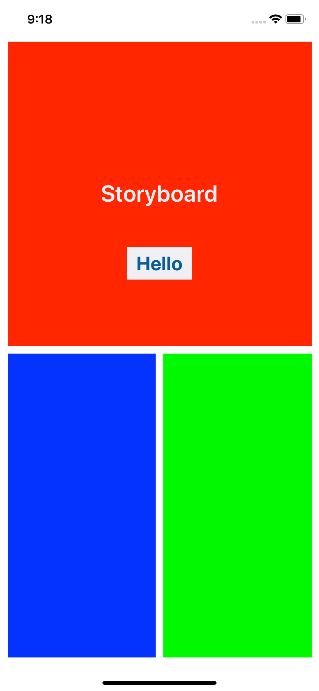
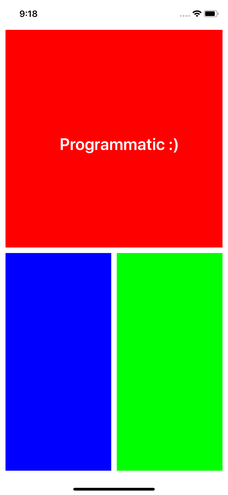

# AutoLayout Tutorial
A tutorial worksheet on Autolayout made for the Mobile Developers of Berkeley Training program.

It covers
- Using Interface Builder (IB) to set constraints
- Settings constraints programmatically
- Writing constraints to handle different size classes
- Writing constraints to allow rotation
- Stack Views

# Using the Worksheet
On the master branch, all storyboard view controllers are empty, and the `StoryboardViewController` and `AutoLayoutViewController` are unimplemented.

To fill in the worksheet
- Build the UI for the `AutoLayoutViewController` programmatically using `NSLayoutConstraint` and `UIStackView`. 
  - Use `traitCollections` to handle rotation
- Use Interface Builder (IB) to build the view for `StoryboardViewController`
  - Use constraint customizations to handle rotation for iPhones
  - Use IBOutlet and IBAction to hook up the `UILabel` and `UIButton` to work properly
    - The `UIButton` should change the text of the `UILabel` to say "Hello"

Solutions to the worksheet can be found on the solutions branch

# Tips
- Don't forget to use `view.safeAreaLayoutGuide`
- If XCode is telling you that your constraints are ambiguous, that means you don't have enough of them
- XCode can suggest constraints to you
- Remember the priority property of `NSLayoutConstraint`
- Don't forget to set `translatesAutoresizingMaskIntoConstraints` to `false` for each programmatic view

# Screenshots

<h2>Storyboard View</h2> 

<h2>Programmatic View</h2> 

